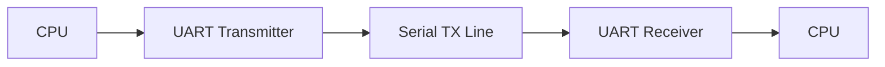

# UART Architecture

Version: 1.0

Author: Biswabandhu Sahoo

This document describes the architecture of the UART RTL Design project. It explains how different hardware modules interact to perform asynchronous serial communication.

## High-Level Block Diagram

```text
             +-------------------------+
             | Baud Rate Generator     |
             +-----------+-------------+
                         |
          +--------------+--------------+
          |                             |
          |                             |
+---------v---------+         +---------v---------+
| UART Transmitter  |         | UART Receiver     |
+---------+---------+         +---------+---------+
          |                             ^
          |                             |
          +-------------TX--------------+
```

## UART Modules

| Module | Purpose |
|--------|---------|
| Baud Rate Generator | Generates baud enable pulses |
| UART Transmitter | Converts parallel data to serial data |
| UART Receiver | Converts serial data to parallel data |
| UART Top | Connects all UART modules |
| Testbench | Verifies UART functionality |


## UART Data Flow




